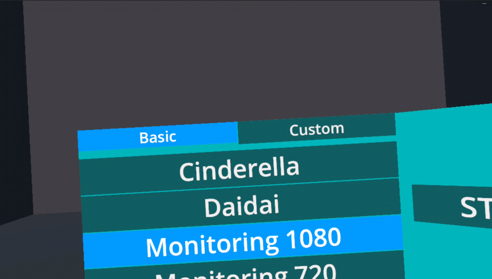
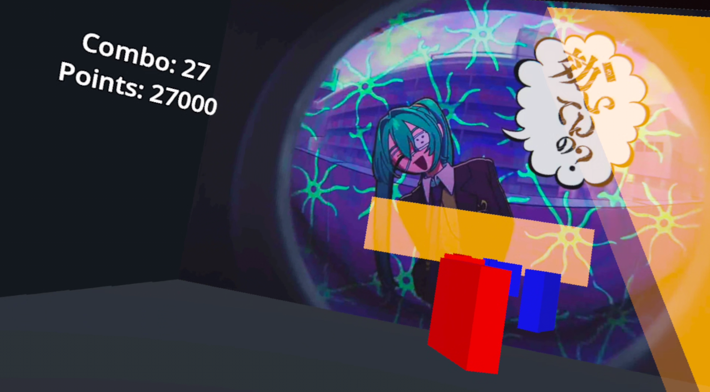

VR game that represents a mix of ideas between a "Beat Saber" and a "Les Mills BodyCombat".
Aforementioned projects are good on their own, but while Beat Saber has a huge community and countless custom maps it lacks in fitness. 
Les Mills BodyCombat has great fitness capabilities, but the lack of community-made variety of maps makes the game stale quickly.
This project takes the best of both worlds and merges it into one project.
Mapping freedom of Beat Saber (using a dedicated map creator) [https://gitlab.com/bohdan.bondarenko/beat-combat-level-creator]
And fitness levels of Les Mills BodyCombat.

Dev-tested using Meta Quest 2 & 3

